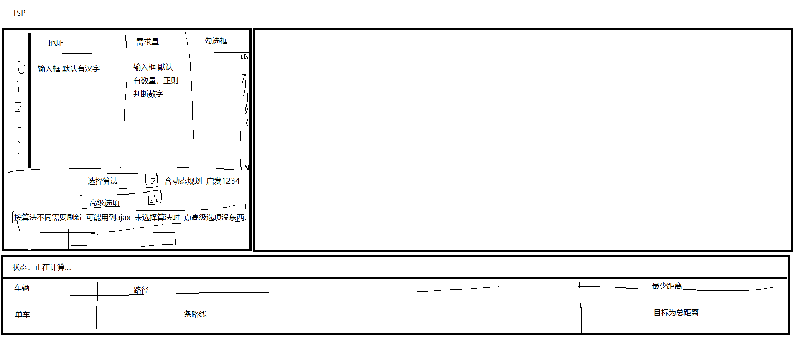
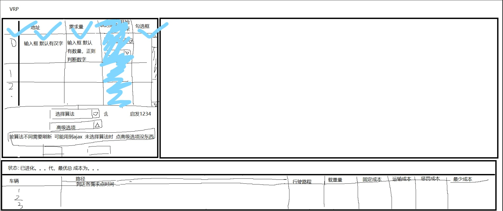

# an online solver to the vehicle routing problem

## 试用

进入 [部署网址](https://liukewia.github.io/bmap-routing/) 后，无视有关于用户的 warning，点击上方 TSP / VRP header 进行试用。

## 绕过登录模块方法

已部署的网站为绕过登录的版本。

step1：

注释掉 `./src/app.tsx` 中 `onPageChange` 方法，即：

```js
onPageChange: () => {
  // const { location } = history;
  // 如果没有登录，重定向到 login
  // if (!initialState?.currentUser && location.pathname !== '/user/login') {
  //   history.push('/user/login');
  // }
},
```

step2:

注释掉 `./config/routes.ts` 中有关 `/user` 的路由，即：

```js
// {
//   path: '/user',
//   layout: false,
//   routes: [
//     {
//       path: '/user',
//       routes: [
//         {
//           name: 'login',
//           path: '/user/login',
//           component: './User/login',
//         },
//       ],
//     },
//   ],
// },
```

## 草图




